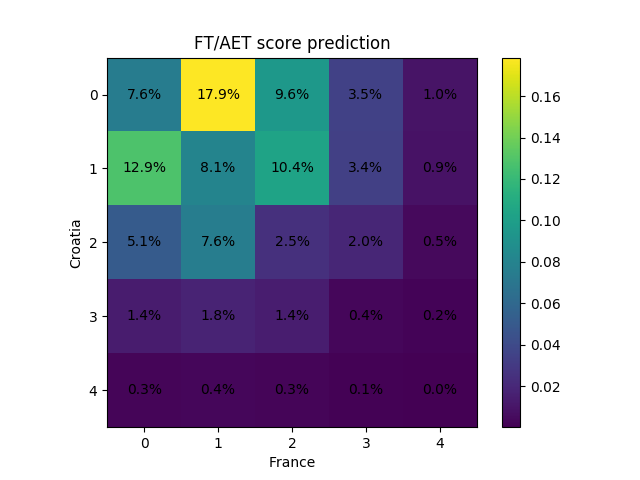

# dixon-coles-worldcup

My wife entered a World Cup prediction contest at her workplace.
Every day of the tournament, the participants predict the exact score
of a selected game, and those who guessed right split the day's jackpot.
Predicting exact scores is a mug's game, but sending my wife back
with detailed arguments in favour of a proper Asian Handicap setup would 
have aroused suspicions.

## The group stage
I had 3 hours notice to submit the 16 predictions for the group stages, so I 
did a crude copy & paste job from [@Torvaney](https://github.com/torvaney)'s 
[blogpost](http://www.statsandsnakeoil.com/2018/06/05/modelling-the-world-cup-with-regista/).
Running the `predict` function from `groups.R` spits out the probability
mass for all scores from 0:0 to 3:3.

## The knockout stage
For the knockout stages I had a little more time, but I spent it reimplementing
Dixon-Coles in Stan. The one departure from pure Dixon-Coles is counting the
World Cup games thrice in the model, in this way ensuring that they influence 
the model much more than other games. It's hacky, but I don't care really.
Speaking of hacky, the model has the following drawbacks:
* No information beyond the scores is used (so no shots, xG, etc.) This has led
the model to overestimate Belgium quite a bit.
* The home field advantage factor is the same for friendlies and qualifiers and the
World Cup proper. This means that the model underestimated Russia somewhat.
* As noted by [@Torvaney](https://github.com/torvaney) in the original post,
there is insufficient information for the ratings to work with the same accuracy 
across confederations as they do within, which is a problem especially for the
group stages.

To run the model, it is best to open an IPython console and say:
```python
%run knockouts.py
data, team_map = wrangle()
samples = fit(data, chains=7, iter=4000)  # 7 chains * 2k steps = 14k samples
predict("France", "Croatia", neutral=True, aet=True)
```
which displays the prediction for the final on Sunday:


Over the course of the contest our predictions have often been 0-0 and 1-0,
with precious few 2-1s. This follows from the low-scoring nature of football,
but when put together in a list it looks strange. Still, the system works. So far, 
we have gotten Spain 1-0 Iran, France 0-0 Denmark, Colombia 1-0 Senegal 
and Sweden 1-0 Switzerland correct, placing us a joint second with 
the total winnings of CHF 90 (that is CHF 40 net, as the entry fee was CHF 50.)
Not bad.
